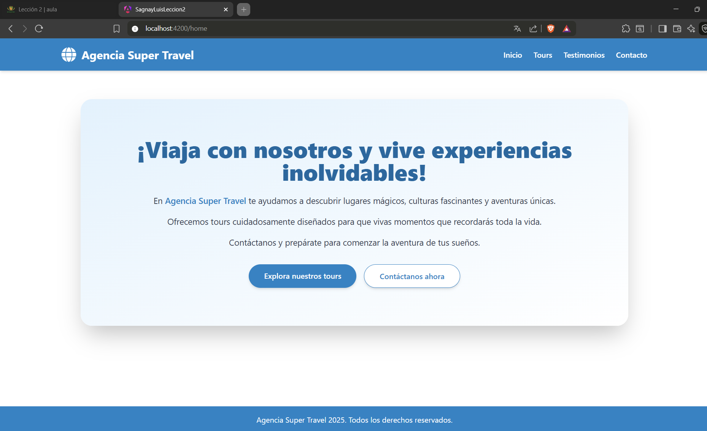
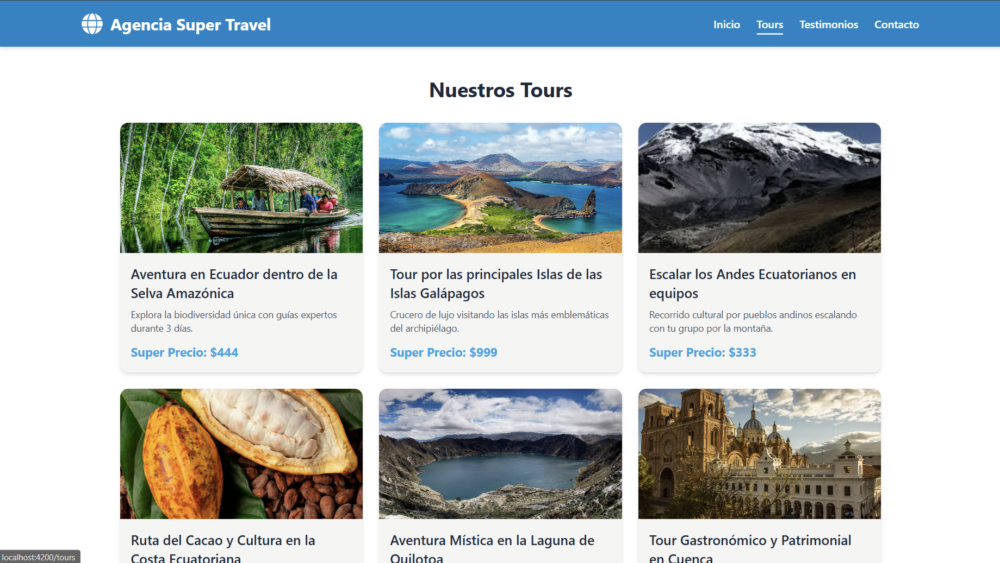
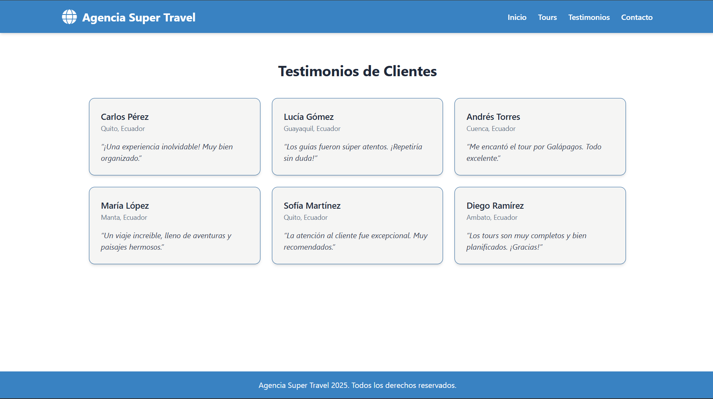
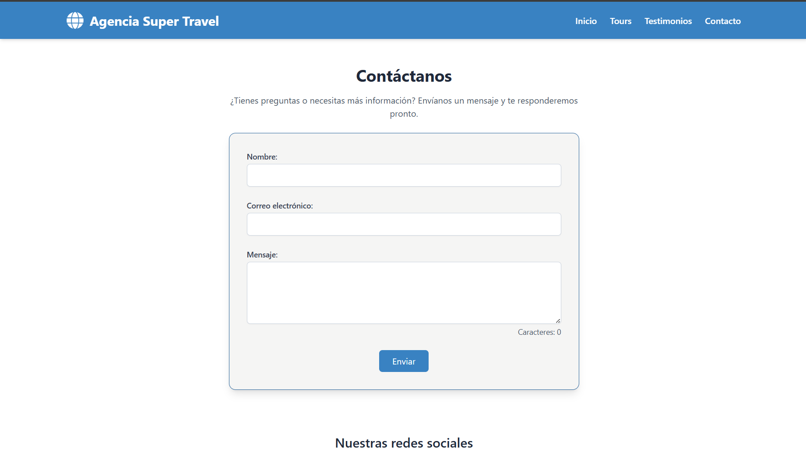

# SagnayLuisLeccion2

This project was generated using [Angular CLI](https://github.com/angular/angular-cli) version 20.0.1.

# Agencia Travel - Sitio Web con Angular

Este proyecto es una aplicación web para una agencia de viajes desarrollada con Angular. Permite a los usuarios explorar tours turísticos, leer testimonios de otros viajeros y contactar a la empresa. La aplicación utiliza tecnologías modernas como componentes standalone, TailwindCSS y el sistema reactivo de signals y computed para lograr una experiencia fluida y modular.

---

## Características

- Diseño adaptable (responsive) usando TailwindCSS.
- Navegación entre páginas mediante Angular Router.
- Uso de componentes UI reutilizables.
- Manejo de estado reactivo con signals.
- Caracteres en vivo usando funciones computed.
- Formulario de contacto con validación.
- Estructura clara del proyecto separando layout, páginas y componentes UI.

---

## Estructura del Proyecto

```
src/
│
├── app/
│   ├── layout/
│   │   ├── header/              # Logo y navegación principal
│   │   └── footer/              # Pie de página
│   │
│   ├── pages/
│   │   ├── home/                # Página principal
│   │   ├── tours/               # Catálogo de tours
│   │   ├── testimonials/        # Opiniones de clientes
│   │   └── contact/             # Formulario de contacto
│   │
│   └── ui/
│       ├── card-tour/           # Tarjeta individual de tour
│       └── card-testimonials/   # Tarjeta individual de testimonio
│
├── assets/                      # Imágenes y archivos estáticos
├── styles.css                   # Estilos globales y Tailwind
└── main.ts                      # Bootstrap principal
```

---

## Instalación y configuración

1. Clonar el repositorio:

```bash
git clone https://github.com/usuario/agencia-travel.git
cd agencia-travel
```

2. Instalar las dependencias:

```bash
npm install
```

3. Instalar y configurar TailwindCSS:

```bash
npm install -D tailwindcss postcss autoprefixer
npx tailwindcss init
```

4. Editar `tailwind.config.js`:

```js
export default {
  content: ["./src/**/*.{html,ts}"],
  theme: {
    extend: {},
  },
  plugins: [],
};
```

5. Agregar las directivas en `src/styles.css`:

```css
@tailwind base;
@tailwind components;
@tailwind utilities;
```

6. Ejecutar el servidor de desarrollo:

```bash
ng serve
```

---

## Funcionalidades por página

### Home (`/`)

- Introducción de bienvenida.
- Llamado a la acción hacia las páginas de tours y contacto.
- Fondo visual atractivo con degradados y diseño centralizado.

### Tours (`/tours`)

- Visualización de tours turísticos en tarjetas responsivas.
- Información como título, descripción, imagen y precio.
- Implementado con el componente reutilizable `card-tour`.

### Testimonials (`/testimonials`)

- Testimonios reales de clientes.
- Diseño en cuadrícula con el componente `card-testimonials`.

### Contact (`/contact`)

- Formulario para enviar nombre, correo y mensaje.
- Validación de campos.
- Uso de `signals` y `computed` para manejar estado reactivo.
- Visualización dinámica del conteo de caracteres.

---

## Capturas del sitio






---

## Autor

Luis Sagnay  
Estudiante de Ingeniería de Software – ESPE  
Proyecto de práctica para la materia de Desarrollo Web Avanzado